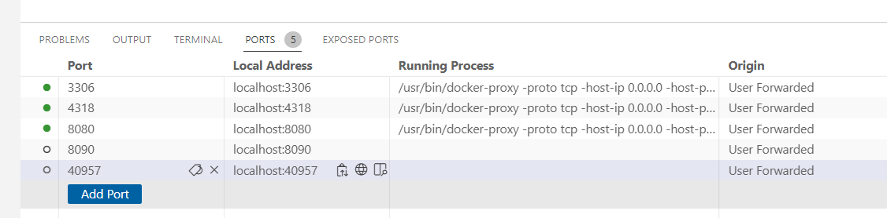
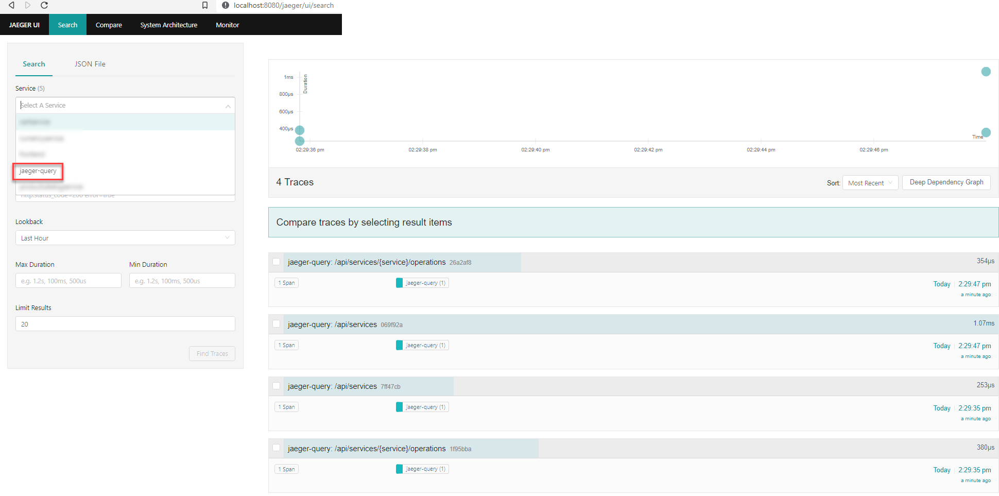
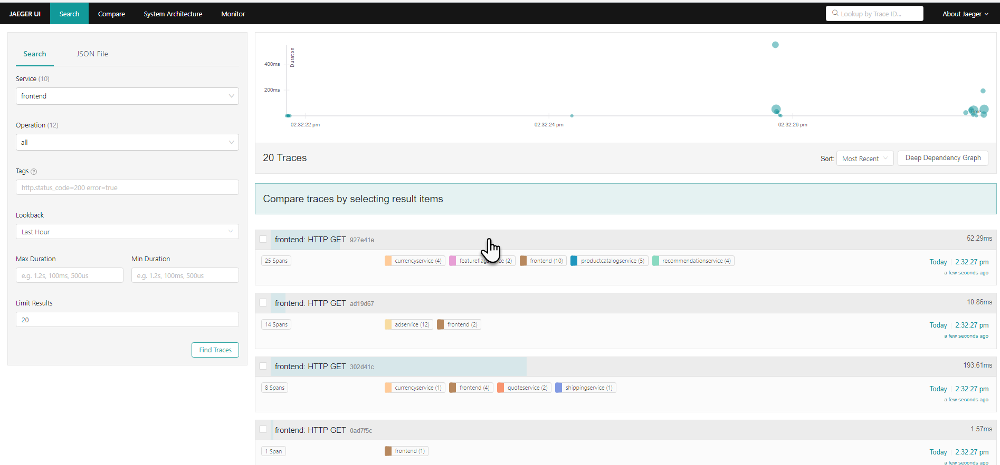
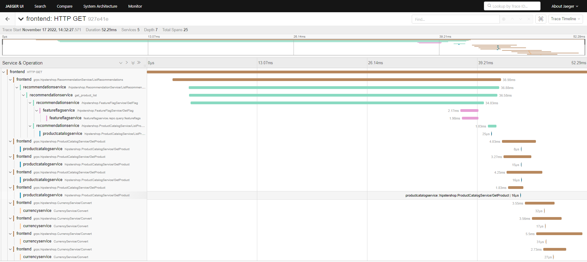
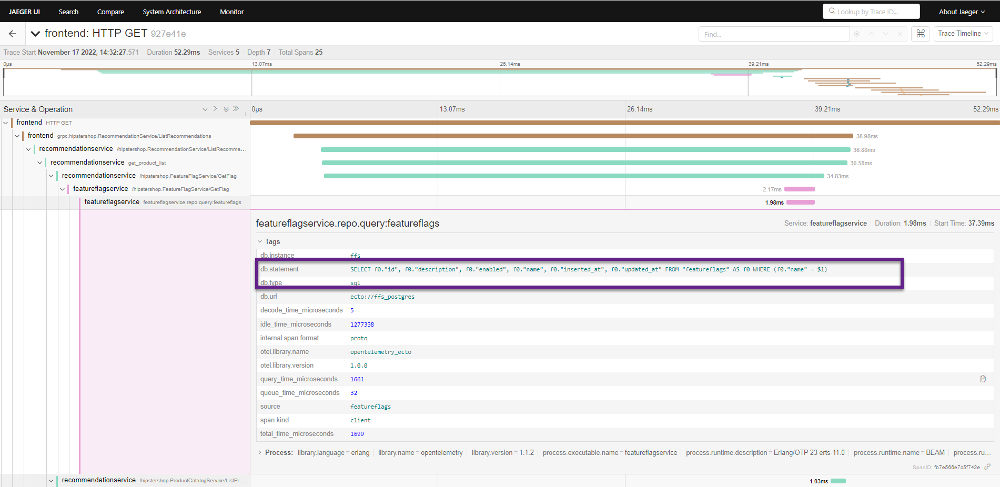
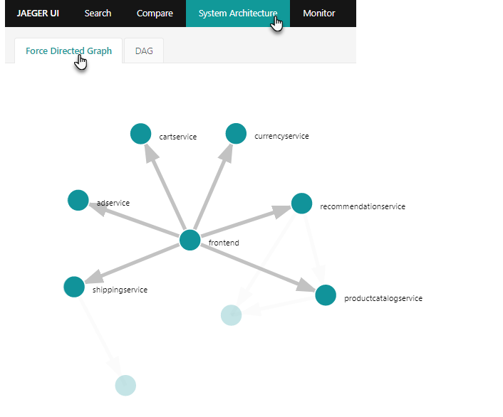

# Gitpod workspace for exploring OpenTelemetry 
[](https://gitpod.io/#https://github.com/lucasjellema/gitpod-opentelemetry)

The instructions are based on this [OpenTelemetry Demo document](https://github.com/open-telemetry/opentelemetry-demo/blob/main/docs/docker_deployment.md)

Clone the Webstore Demo repository:
```
git clone https://github.com/open-telemetry/opentelemetry-demo.git
```

Navigate to the folder that holds the cloned repository:

```
cd opentelemetry-demo/
```

Run Docker Compose to start the demo:
```
docker compose up --no-build
```


## Open Gitpod Workspace in VS Code Desktop

The demo application can best be run locally - using port forwarding in for example VS Code (because it uses references to localhost for example to publish metrics that are not resolved correctly in the Gitpod workspace VS Code browser environment).  So, open the workspace in VS Code Desktop (open the command palette in the VS Code Browser - using `CTRL+Shift+P` on a Windows machine) and select Gitpod: Open in VS Code.


Once the images are built and containers are started and the workspace is opened in VS Code Desktop, make sure that port 8080 is exposed publicly as well as forwarded, as well as port 4318 (where traces are published to):

  

Now you can access:

Monitoring tools:
* Grafana (metrics): http://localhost:8080/grafana/
* Jaeger UI (traces and logs): http://localhost:8080/jaeger/ui/

Before accessing the webstore - there will probably not be many traces visible in Jaeger. Note that just by querying for traces in Jaeger, additional trace information is created (because Jaeger itself is also instrumented).
  

Now access the Webstore Demo application: http://localhost:8080/ and perform some actions. Subsequently, check in Jaeger if you can find the traces for your actions - and whether the tags associated with those traces are available too. Note: they can even reveal the SQL statements executed against the PostgreSQL database. 

  

Drill down on one specific trace reveals the spans under that trace:
  

Click the span to find the tags associated with the span:

  

You can take a look at the tab *Force Directed Graph* to see a visualization of the dependencies as derived from the trace details:
   

## Next Steps with OpenTelemetry Demo

Create additional load:
Load Generator UI: http://localhost:8080/loadgen/

Use these scenarios to explore:

https://github.com/open-telemetry/opentelemetry-demo/tree/main/docs#scenarios

Details about Instrumentation in specific technologies (such as Java, .NET, JavaScript (frontend and Node), Python and more):

https://github.com/open-telemetry/opentelemetry-demo/tree/main/docs#language-feature-reference 

The source code for this demo can be found in GitHub: [OpenTelemetry Demo - source code](https://github.com/open-telemetry/opentelemetry-demo/tree/main/src)

# Other explorations

The OpenTelemetry project provides many instructions/tutorials for instrumenting different types of applications. Applications can be made to publish traces, logs and metrics in an OpenTelemetry compliant fashion. This can be done from within the code - and sometimes simply by adding configuration to the project and the way the application is started (for example for Java and Node).

Some interesting tutorials:

* [Instrumenting a Browser - HTML/JS webapplication](https://opentelemetry.io/docs/instrumentation/js/getting-started/browser/)
* [Instrumenting a NodeJS application](https://opentelemetry.io/docs/instrumentation/js/getting-started/nodejs/)
* [Instrumenting a .NET application - get started](https://opentelemetry.io/docs/instrumentation/net/getting-started/)
* [Automatic Instrumentation of a Java application using a Java Agent](https://opentelemetry.io/docs/instrumentation/java/automatic/)

